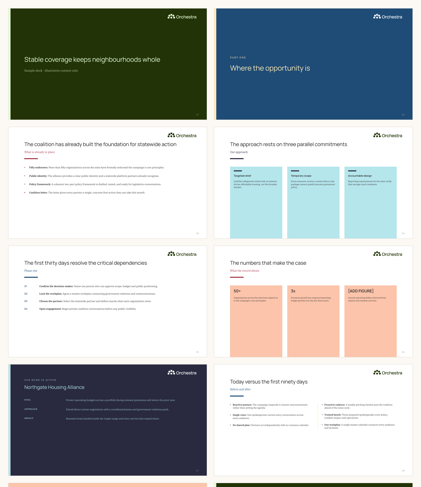
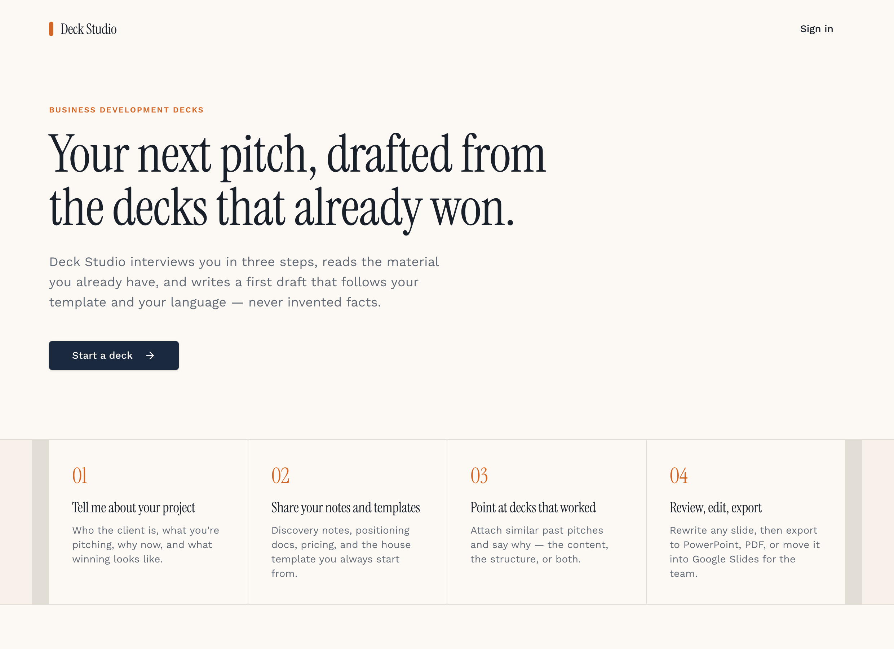
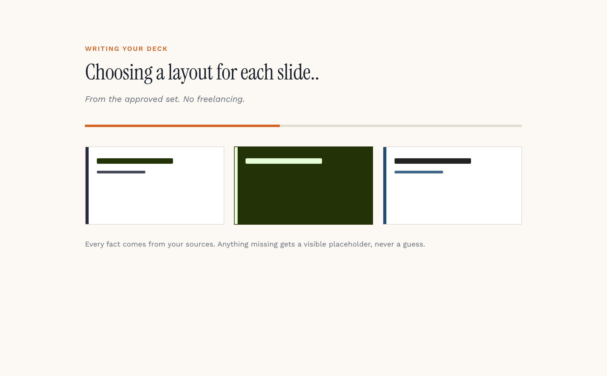

# Deck Studio

Business development decks, drafted from the material you already have and set in the Orchestra brand.

You answer three questions, hand over your notes and the past pitches that worked, and Deck Studio returns a first draft you can edit, present, and export to PowerPoint. Every fact on every slide comes from something you supplied. Where a number is needed and missing, the draft leaves a visible placeholder rather than inventing one.



## The problem this solves

Most people building a pitch deck start by copying the last one. That works until the copy is a copy of a copy, and the deck has drifted a long way from the brand it is supposed to represent. Meanwhile the writing gets recycled along with the layout, so the argument in the new deck is really the argument from the old one.

Deck Studio splits those two jobs apart. The model writes the argument from your sources. It never designs anything.



## How it works

**1. Tell it about the project.** Who the client is, what you are pitching, why now, what winning looks like.

**2. Hand over your material.** Discovery notes, positioning docs, pricing, the house template. Text is read in the browser before upload, so PowerPoint, PDF, Word, plain text and CSV all work.

**3. Point at decks that worked, and say why.** Whether you mean the content, the structure, or both. That one sentence is what makes the draft sound like your team instead of a generic pitch.

**4. Approve the outline.** The model proposes the slide-by-slide shape first. Retitle, reorder, delete, then generate.

**5. Review, rewrite, export.** Edit any slide by hand, rewrite one with a nudge in plain English, then download a `.pptx`, print to PDF, or move the deck into Google Slides for the team.



## The design system

The model chooses **what a slide says**. It never chooses how the slide looks.

Layout is a closed set of ten approved options, enforced in three places: the JSON schema the model must answer in, the editor's layout picker, and both renderers. Anything unrecognised degrades to plain bullets rather than inventing a new look.

| Layout | For |
| --- | --- |
| `title` / `closing` | Opening and next steps, on the forest and mint hero pair |
| `section` | A divider where the deck genuinely turns a corner |
| `bullets` | The standard content slide |
| `two-column` | A real contrast: before and after, problem and solution |
| `pillars` | Three parallel ideas of equal weight |
| `process` | Steps that happen in order, numbered |
| `stat` | Three findings that each lead with a number |
| `case-study` | One piece of proof, as goal, approach and impact |
| `quote` | A single quotation with attribution |

Colour is deterministic too. The hero pair is reserved for the opening and closing slides, and the three secondary families rotate across the deck by slide position, so a deck is varied without anyone choosing. The same palette function drives the on-screen preview and the PowerPoint export, which is why the two agree.

Type is Manrope and IBM Plex Serif, the approved substitutes for the licensed brand faces, and the logo is the official file rather than a redrawing.

## Writing rules the draft follows

- Headlines are assertive claims the slide then proves, not topic labels.
- Bullets are written as `Short label: full sentence`, the pattern real Orchestra decks use, and the label is set in bold.
- Titles and subtitles are sentence case.
- No invented metrics, client names, case-study results, dates or quotes. Missing figures become `[ADD FIGURE]`.
- Statement slides carry no body copy, so a title slide never arrives with four bullets on it.

## Fitting text to a real slide

The browser preview scales type to its container, so text always fits. PowerPoint does not: it puts fixed type in fixed boxes, and long copy runs off the edge of the slide.

The exporter therefore sizes every headline and body block against its own length, gives each text box shrink-to-fit as a second line of defence, and builds every body block down to a shared floor so slides do not end at different heights. Exports are checked by parsing the generated XML and asserting that no shape falls outside the slide.

## Running it locally

```bash
bun install
bun run dev
```

The app needs a Supabase project for auth and storage, and `LOVABLE_API_KEY` for generation. Without that key the app runs and the editor works, but the two generation steps will report that AI is not configured.

```bash
bun run build     # production build
bun run lint      # eslint, with prettier enforced as errors
bun run format    # apply prettier
```

## How the code is laid out

```
src/lib/
  slide-layouts.ts        the approved layout set, and the bullet parser
  palette.ts              per-slide colour rotation, shared by preview and export
  brand.ts                brand tokens and the CSS variables the preview reads
  deck-prompt.ts          system prompt, outline prompt, slide prompt
  deck-generation.server.ts   outline, full deck, and single-slide rewrite
  export-pptx.ts          PowerPoint export
  extract-text.ts         reads uploaded files in the browser
src/components/
  SlidePreview.tsx        renders one slide, container-query scaled
  GenerationOverlay.tsx   the generation screen
  SourceCollector.tsx     upload and note capture
src/routes/_authenticated/decks/
  new.tsx                 step one
  $deckId/intake.tsx      steps two to four, and the outline review
  $deckId/index.tsx       the editor
  $deckId/print.tsx       print and PDF view
```

Built with TanStack Start, Supabase, Tailwind and shadcn/ui. Generation runs on GPT-5.6 through the Lovable AI gateway. Editing happens in [Lovable](https://lovable.dev/projects/1175a3a0-db3d-4191-8044-8c3becd32337), and commits pushed to `main` sync back into the editor, so avoid rewriting published history.

## Notes

Sample content in the screenshots is illustrative and does not describe a real client engagement.
